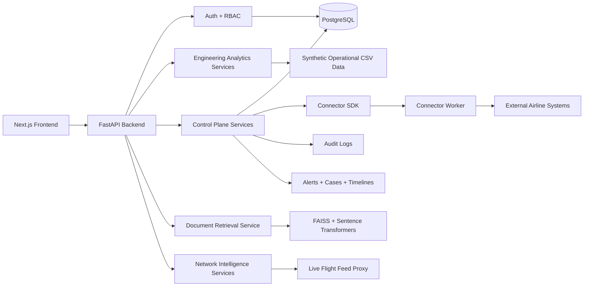

<h1 align="center">🛫 AOG Sentinel</h1>

<p align="center">
  <strong>Aircraft Fleet Reliability, Connector Control Plane & Network Intelligence Platform</strong>
</p>

<p align="center">
  <em>One operational workspace for airline engineering, maintenance control, spares planning, technical retrieval, connector orchestration, and live network intelligence.</em>
</p>

<p align="center">
  
  
  
  
</p>

<p align="center">
  
  
  
  
  
  
</p>

<p align="center">
  <a href="#-what-is-aog-sentinel">Overview</a>
  ·
  <a href="#-architecture">Architecture</a>
  ·
  <a href="#-product-modules">Modules</a>
  ·
  <a href="#-local-setup">Local Setup</a>
  ·
  <a href="#-api-surface">API</a>
  ·
  <a href="#-enterprise-ready-outcomes">Outcomes</a>
</p>

---

## ⚡ What is AOG Sentinel?

**AOG Sentinel** is an airline engineering operations platform for managing fleet reliability, aircraft-on-ground risk, connector visibility, technical retrieval, spares exposure, case workflows, and live network intelligence in one locally runnable system.

It is designed for teams working across:

```txt
Engineering Control → Maintenance Control → Reliability → Logistics → Network Ops
```

AOG Sentinel turns fragmented operational data into a unified engineering command workspace.

---

## 🧠 Product Thesis

Airline engineering teams do not fail because they lack dashboards.

They fail because operational context is scattered across disconnected systems.

```txt
Defects live in one system.
Spares live in another.
Flight status lives somewhere else.
Technical references are buried in documents.
Shift handover exists in notes.
Connector failures are invisible until something breaks.
```

AOG Sentinel brings those layers together into a control plane for engineering operations.

> **AOG Sentinel is built for the moment when aircraft reliability, spares risk, connector health, and live network posture need to be understood together.**

---

## 🚨 Problem Statement

Airline engineering, maintenance control, logistics, and reliability teams usually work across disconnected systems:

- MRO platforms
- inventory tools
- live-flight feeds
- technical references
- connector jobs
- shift handover notes
- alert queues
- case workflows

That fragmentation creates real operational drag:

| Operational Pain | Impact |
|---|---|
| Disconnected aircraft data | Slower defect investigation |
| Weak repeat-defect visibility | Missed reliability patterns |
| Manual AOG triage | Delayed recovery decisions |
| Siloed spares planning | Increased stockout exposure |
| Invisible connector failures | Broken operational trust |
| Dashboard-only tooling | No ownership, SLA, or workflow continuity |
| Separated network view | Weak connection between engineering risk and live operations |

AOG Sentinel closes this gap with a unified engineering workspace, persistent control-plane backend, connector orchestration layer, and map-first network intelligence environment.

---

## ✅ What AOG Sentinel Provides

| Layer | Capability |
|---|---|
| Fleet Reliability | ATA concentration, repeat defects, aircraft risk ranking |
| AOG Operations | Dispatch-critical incident triage and prioritization |
| Spares Planning | Forecast demand, reorder quantity, and stock-risk status |
| Technical Retrieval | Local document assistant using embeddings + keyword fallback |
| Control Plane | Workspace auth, RBAC, alerts, cases, audit logs |
| Connector Orchestration | Catalog, manifests, config validation, sync runs, cursors |
| Network Intelligence | Live flights, owned fleet overlays, airports, routes, weather, 3D globe |
| Case Workflow | Persistent alerts, ownership, SLA clocks, timelines |

---

## 🛫 Why This Matters for Airline Engineering Teams

AOG Sentinel helps engineering teams:

- consolidate defects, MEL-impacting signals, spares risk, and technical context
- identify repeat-defect patterns before they become operationally expensive
- connect reliability analysis with live aircraft and route posture
- make connector failures visible as operational events
- turn alerts into owned cases with timeline continuity
- support hybrid deployment where connector workers can run airline-side when required

```txt
Less context switching.
Faster triage.
Cleaner ownership.
Better operational accountability.
```

---

## 🧩 Core Product Areas

### 1. Fleet Reliability Control Tower

A dashboard for engineering teams to understand fleet health at a glance.

Includes:

- ATA concentration
- open defects
- AOG exposure
- repeat defects
- top unreliable components
- aircraft risk ranking
- reliability snapshots
- maintenance history

---

### 2. Aircraft-Level Engineering Detail

Each aircraft gets a dedicated engineering view.

Includes:

- tail-level history
- recurring component issues
- maintenance log context
- defect timeline
- reliability score
- risk indicators
- operational context

---

### 3. AOG Incident Command Queue

A dispatch-critical workspace for aircraft-on-ground triage.

Includes:

- prioritized AOG cases
- engineering impact context
- aircraft status
- defect severity
- spares dependency
- escalation-ready queueing

---

### 4. Reliability Analytics

A focused reliability analytics layer for engineering review.

Includes:

- ATA breakdown
- vendor/component trends
- repeat-defect analysis
- rectification distribution
- component reliability ranking
- aircraft risk comparison

---

### 5. Spares Recommendation Engine

A spares exposure and reorder planning workspace.

Includes:

- forecasted demand
- stock-risk status
- reorder quantity
- part-level risk
- exposure indicators
- logistics planning support

---

### 6. Technical Document Assistant

A local technical retrieval layer for maintenance and reference material.

Uses:

- `sentence-transformers`
- `FAISS`
- keyword fallback
- local manual chunks
- degraded-mode search support

Designed to stay runnable even when embeddings are unavailable.

---

### 7. Connector Control Plane

A manifest-driven integration layer for airline systems.

Includes:

- connector catalog
- connector installs
- config schema
- secret-field handling
- validation state
- sync runs
- cursor visibility
- runtime health reporting

---

### 8. Network Intelligence Workspace

A map-first operational workspace connecting engineering risk to live network posture.

Includes:

- 2D radar default mode
- 3D Cesium world view
- live-flight feed proxy
- owned-fleet matching
- maintenance base overlays
- disruption hotspots
- airport congestion
- weather overlays
- derived traffic corridors
- dense-traffic readability improvements

---

## ⚙️ Architecture



---

## 🔁 Operational Flow

AOG Sentinel connects analytics, cases, connectors, and network posture into one workflow:

```txt
1. Ingest operational data
2. Normalize aircraft, defect, maintenance, spares, and connector records
3. Surface reliability and AOG risk
4. Create alerts and cases
5. Assign ownership and preserve timeline history
6. Validate connector health and sync state
7. Overlay engineering context onto live network intelligence
8. Support triage, recovery, and operational review
```

---

## 🧠 System Design View

```txt
┌──────────────────────────────────────────┐
│              Airline User                │
│ Reliability / MCC / Logistics / Admin    │
└───────────────────┬──────────────────────┘
                    ↓
┌──────────────────────────────────────────┐
│            Next.js Frontend              │
│ Dashboard · AOG · Flights · Cases        │
└───────────────────┬──────────────────────┘
                    ↓
┌──────────────────────────────────────────┐
│              FastAPI Layer               │
│ Auth · Analytics · Connectors · Network  │
└───────────────────┬──────────────────────┘
                    ↓
┌──────────────────────────────────────────┐
│         Control Plane + Services         │
│ RBAC · Alerts · Cases · Runs · Cursors   │
└───────────────────┬──────────────────────┘
                    ↓
┌──────────────────────────────────────────┐
│             PostgreSQL Core              │
│ Workspaces · Users · Cases · Connectors  │
└───────────────────┬──────────────────────┘
                    ↓
┌──────────────────────────────────────────┐
│      Operational Intelligence Layer      │
│ CSV Data · FAISS Search · Live Flights   │
└──────────────────────────────────────────┘
```

---

## 🧭 Product Modules

| Route | Module |
|---|---|
| `/dashboard` | Fleet reliability control tower |
| `/aircraft/[id]` | Aircraft-level engineering detail |
| `/aog` | AOG prioritization queue |
| `/reliability` | ATA, vendor, component, and repeat-defect analytics |
| `/spares` | Parts exposure and reorder planning |
| `/docs` | Technical document assistant |
| `/flights` | Network intelligence workspace |
| `/alerts` | Operational alert command center |
| `/cases` | Engineering workflow cases and timelines |
| `/connectors` | Connector registry, catalog, validation, runs, and cursors |
| `/admin` | Workspace and platform status |
| `/login` | Authentication entry point |

---

## 🖥️ Interface Coverage

The application includes the following product surfaces:

| Surface | Purpose |
|---|---|
| Secure login | Authenticated airline workspace access |
| Fleet dashboard | High-level reliability and risk control tower |
| Aircraft detail | Tail-level engineering history and defect context |
| AOG queue | Dispatch-critical incident prioritization |
| Reliability analytics | ATA, vendor, component, and repeat-defect analysis |
| Spares workspace | Parts exposure and reorder planning |
| Technical docs | Local document search and reference retrieval |
| Network intelligence | Live 2D/3D fleet and airport operations workspace |
| Alerts | Persistent operational alert command center |
| Cases | Engineering ownership, timelines, and workflow continuity |
| Connectors | Catalog, validation, runs, cursors, and integration health |
| Admin | Workspace and platform status |

---

## 🗂️ Data Model

### Operational Analytics Sources

```txt
backend/data/aircraft.csv
backend/data/defects.csv
backend/data/maintenance_logs.csv
backend/data/spares.csv
backend/data/manual_chunks.csv
```

These provide the synthetic operational foundation for the local engineering demo.

---

### Persistent Control-Plane Entities

AOG Sentinel persists operational workflow state in PostgreSQL.

Core entities include:

- users
- roles
- permissions
- workspace memberships
- workspaces
- fleets
- sites
- owned aircraft overlays
- refresh sessions
- audit logs
- connector catalog
- connector installs
- connector configs
- connector runs
- connector cursors
- operational events
- alerts
- cases
- case timeline entries

---

### Bootstrap Fixtures

```txt
backend/data/platform_seed.json
backend/data/reference/airports_reference.json
```

---

## 🧱 Tech Stack

### Frontend

| Technology | Usage |
|---|---|
| Next.js App Router | Web application shell |
| TypeScript | Type-safe frontend |
| Tailwind CSS | Styling system |
| shadcn-style components | UI primitives |
| Recharts | Charts and analytics |
| Lucide Icons | Interface icons |
| react-simple-maps | 2D map visualization |
| CesiumJS + Resium | 3D globe and network visualization |

---

### Backend

| Technology | Usage |
|---|---|
| FastAPI | Backend API |
| SQLAlchemy 2 | ORM |
| Alembic | Database migrations |
| PostgreSQL | Persistent control-plane storage |
| Pandas | CSV analytics |
| NumPy | Numerical processing |
| scikit-learn | ML/data utilities |
| sentence-transformers | Local embeddings |
| FAISS | Vector search |
| Pydantic | Validation and contracts |
| Argon2 | Password hashing |
| PyJWT | Token authentication |

---

## 🔌 Connector SDK / Plug-and-Play Model

AOG Sentinel uses a manifest-driven connector model.

Each connector defines:

- connector key
- package name
- schema version
- supported entities
- config schema
- required fields
- secret fields
- sync mode
- deployment target
- normalized emitted records
- cursor read/write behavior
- health reporting
- runtime status

Example packaged connectors:

```txt
backend/app/connectors/examples/amos_defects
backend/app/connectors/examples/amos_maintenance
backend/app/connectors/examples/sap_spares
backend/app/connectors/examples/flight_ops_stream
backend/app/connectors/examples/document_hub_reference_sync
```

Connector SDK contract:

```txt
backend/app/sdk/connector_sdk.py
```

Connector runtime state is persisted in PostgreSQL.

---

## 🧪 Document Search

The document assistant loads maintenance excerpts from:

```txt
backend/data/manual_chunks.csv
```

It builds an embedding index lazily using:

```txt
all-MiniLM-L6-v2
```

Search strategy:

```txt
1. Try sentence-transformer embeddings
2. Search FAISS vector index
3. Fall back to keyword ranking when embeddings are unavailable
```

This keeps the platform locally runnable on first boot and in degraded environments.

---

## 🚀 Local Setup

### 1. Clone Repository

```bash
git clone https://github.com/your-username/aog-sentinel
cd aog-sentinel
```

---

### 2. Start PostgreSQL

```bash
docker compose up -d postgres
```

---

### 3. Backend Setup

```bash
cd backend

python3 -m venv .venv
source .venv/bin/activate

pip install -r requirements.txt

cp .env.example .env

python -m alembic upgrade head
```

---

### 4. Frontend Setup

```bash
cd ../frontend

npm install

cp .env.example .env.local
```

---

## ▶️ Development Mode

### Start Backend

```bash
cd backend

source .venv/bin/activate

uvicorn app.main:app --reload --host 127.0.0.1 --port 8000
```

---

### Start Frontend

```bash
cd frontend

npm run dev -- --hostname 127.0.0.1 --port 3000
```

---

## 🌐 Local Endpoints

| Service | URL |
|---|---|
| Frontend | http://127.0.0.1:3000 |
| Backend API | http://127.0.0.1:8000 |
| API Docs | http://127.0.0.1:8000/docs |
| PostgreSQL | Configured through Docker Compose |

---

## 🔐 Seeded Login Accounts

These identities are bootstrapped on first run when:

```txt
AOG_BOOTSTRAP_PLATFORM_DATA=true
```

Set the bootstrap password before first deploy:

```txt
AOG_BOOTSTRAP_DEFAULT_PASSWORD=your-local-password
```

Seeded users:

| Role | Email |
|---|---|
| Platform Admin | `platform.admin@aogsentinel.local` |
| Workspace Engineer | `ekta.rao@sbx.airline.local` |

> Do not publish, reuse, or deploy bootstrap credentials across environments.

---

## 🧭 API Surface

### Auth and Control Plane

```txt
POST /auth/login
POST /auth/refresh
POST /auth/logout
GET  /auth/me

GET  /users/me/workspaces
GET  /roles

GET  /workspaces
GET  /workspaces/{workspace_id}

GET  /alerts
POST /alerts

GET  /cases
POST /cases
GET  /cases/{case_id}
POST /cases/{case_id}/timeline

GET  /connectors/catalog
GET  /connectors/installs
PUT  /connectors/{connector_id}/config
POST /connectors/{connector_id}/validate-config
POST /connectors/{connector_id}/sync
GET  /connectors/{connector_id}/runs
GET  /connectors/{connector_id}/cursor

GET  /network/workspace
```

---

### Analytics

```txt
GET  /dashboard/summary
GET  /dashboard/ata-breakdown
GET  /dashboard/monthly-defects
GET  /dashboard/top-components
GET  /dashboard/aircraft-risk-ranking

GET  /aircraft/{aircraft_id}

GET  /incidents/aog

GET  /reliability/summary
GET  /reliability/ata
GET  /reliability/repeat-defects
GET  /reliability/vendors
GET  /reliability/components
GET  /reliability/rectification-distribution

GET  /spares/recommendations

POST /docs/search
```

---

### Network and Live Flights

```txt
GET /flights/overview
GET /flights/live
GET /network/workspace
```

---

## 🛡️ Security and Deployment Notes

- Do not commit `.env` files
- Use `.env.example` for documented configuration only
- Rotate bootstrap passwords across environments
- Keep connector secrets out of client-side code
- Treat connector configs and cursors as operational control-plane state
- Validate CORS origins before deployment
- Use HTTPS and secure cookie/token settings in production
- Run migrations before deploying backend services

---

## 🧪 Example Connector Manifest Concept

```json
{
  "key": "sap_spares",
  "package": "connectors.sap_spares",
  "schemaVersion": "1.0.0",
  "supportedEntities": ["spares", "inventory", "part_movements"],
  "syncMode": "incremental",
  "deploymentTarget": "airline_side_worker",
  "configSchema": {
    "required": ["baseUrl", "clientId"],
    "secretFields": ["clientSecret", "apiKey"]
  },
  "emits": ["normalized_spare_record", "stock_risk_event"],
  "cursor": {
    "type": "timestamp",
    "field": "updated_at"
  }
}
```

---

## 📊 Product Status

| Area | Status |
|---|---|
| Fleet dashboard | Active |
| Aircraft detail pages | Active |
| AOG queue | Active |
| Reliability analytics | Active |
| Spares recommendations | Active |
| Document retrieval | Active |
| Auth/RBAC | Active |
| Alerts/cases | Active |
| Connector catalog | Active |
| Connector validation/runs/cursors | Active |
| Network intelligence workspace | Active |
| 3D Cesium view | Active |
| Production airline integrations | Demo/synthetic baseline |

---

## 🧠 Design Principles

AOG Sentinel is built around six product principles:

```txt
1. Operational context beats isolated dashboards.
2. Alerts must become owned workflows.
3. Connector health is part of operational reliability.
4. Engineering risk should connect to live network posture.
5. Local-first demos should still look enterprise-grade.
6. Airline-side deployment paths matter for sensitive integrations.
```

---

## 🏢 Enterprise Workflow Model

AOG Sentinel supports a hybrid deployment model:

```txt
Hosted Control Plane
        +
Airline-Side Connector Workers
        +
Workspace-Scoped RBAC
        +
Persisted Alerts, Cases, Runs, Cursors, and Audit Logs
```

This structure allows airline teams to keep sensitive integrations closer to their environment while still using a centralized operational control plane.

---

## 🧾 Example Operational Scenario

```txt
A recurring defect appears on the same aircraft family.

AOG Sentinel detects:
- ATA concentration increasing
- repeat component failures
- aircraft risk ranking moving upward
- spares exposure increasing
- route corridor density around affected aircraft
- connector sync health for relevant systems

The team can:
- inspect aircraft-level history
- open an engineering case
- assign ownership
- check related spares
- search technical references
- view live network impact
- track the full timeline
```

---

## 🚀 Enterprise-Ready Outcomes

This project demonstrates the ability to build a full-stack, operationally realistic airline engineering platform with:

- fleet reliability analytics
- AOG incident triage
- spares planning
- local technical document retrieval
- connector orchestration
- persistent alerts and cases
- workspace-scoped authentication
- RBAC
- audit logs
- live network intelligence
- 2D and 3D geospatial interfaces
- synthetic but realistic airline operations data
- locally runnable product architecture

Built with:

```txt
FastAPI · Next.js · TypeScript · Python · PostgreSQL · SQLAlchemy · Alembic · FAISS · sentence-transformers · CesiumJS
```

---

## 📌 Note on Data

All airline operational data in this repository is synthetic.

It is intended for:

- demonstration
- portfolio review
- local product development
- technical evaluation
- system design showcase

It is not real airline operational data.

---

## ⭐ Final Thought

Airline engineering teams do not need another static dashboard.

They need an operational control plane that connects:

```txt
Aircraft risk
Defect patterns
Spares exposure
Connector health
Cases
Technical context
Live network posture
```

**AOG Sentinel exists to make airline engineering operations faster, more visible, and more accountable.**
