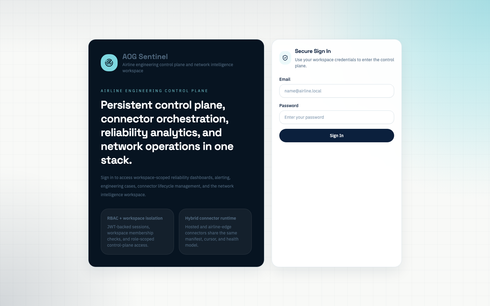
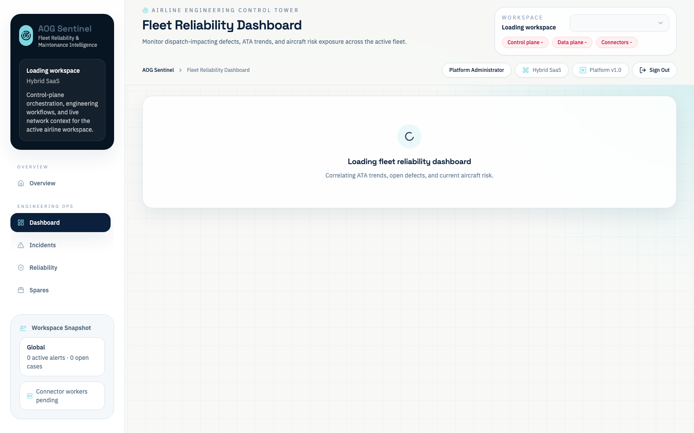
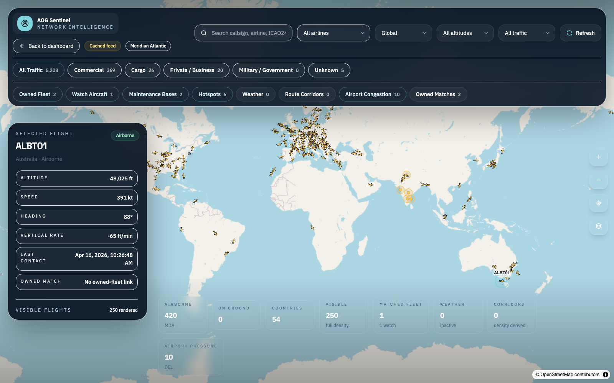
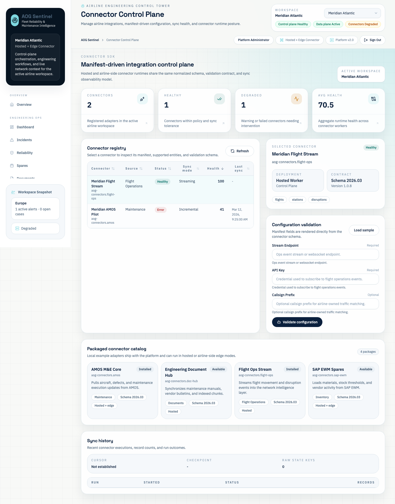
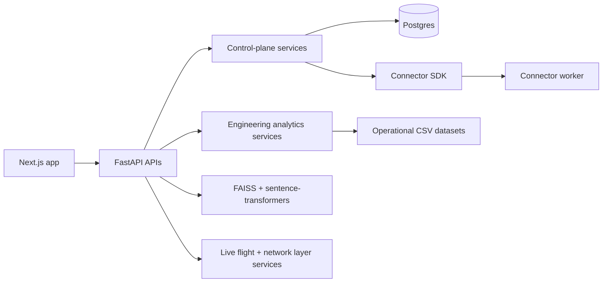

# AOG Sentinel

**Aircraft Fleet Reliability, Connector Control Plane, and Network Intelligence Platform**

AOG Sentinel is an airline engineering platform that combines fleet reliability analytics, incident triage, spares planning, technical retrieval, alert/case workflow, connector orchestration, and live network intelligence in one locally runnable system.

## Problem Statement
Airline engineering, maintenance control, logistics, and reliability teams typically work across disconnected systems: MRO platforms, inventory tools, live-flight feeds, technical references, and shift handover notes. That fragmentation slows AOG response, hides repeat-defect patterns, and weakens operational accountability.

AOG Sentinel closes that gap with a control plane for airline workspaces and connectors, a normalized alert/case workflow layer, and a map-first network workspace tied back to engineering risk.

## Why This Matters for Airline Engineering Teams
- Consolidates defects, repeat events, MEL-impacting signals, spares risk, and technical references into one operational workspace.
- Adds alerting, case ownership, SLA clocks, and timeline continuity instead of stopping at dashboards.
- Exposes connector health, manifests, validation state, runs, and cursors so integration issues are operationally visible.
- Links engineering context to live network posture through owned-fleet matching, maintenance bases, corridor density, airport congestion, and weather overlays.
- Supports a hybrid deployment model: hosted control plane with connector workers that can also run airline-side when required.

## Core Features
### Engineering analytics
- Fleet dashboard for ATA concentration, open defects, AOG exposure, repeat defects, top unreliable components, and aircraft risk ranking.
- Aircraft detail pages for tail-level history, recurring components, maintenance logs, and reliability snapshots.
- Incident command queue for dispatch-critical AOG triage.
- Reliability analytics for ATA/vendor/component breakdown, repeat-defect trends, and rectification distribution.
- Spares recommendation panel with forecasted demand, reorder quantity, and stock-risk status.
- Local technical document retrieval with sentence-transformers + FAISS plus keyword fallback.

### Control plane
- Email/password authentication with JWT access tokens and rotating refresh tokens.
- Workspace-scoped RBAC for airline admins, reliability engineers, maintenance control, logistics, and viewers.
- Persistent Postgres-backed workspaces, memberships, roles, alerts, cases, timeline entries, connector installs, runs, cursors, and audit logs.
- Alert command center and case workflow board backed by persisted entities rather than seed-only state.
- Connector catalog, manifest-driven config, validation, sync runs, and cursor visibility.

### Network intelligence
- Full-screen Network Intelligence Workspace with 2D radar as the operational default and 3D Cesium world view as the secondary mode.
- Live-flight feed proxy with cache-aware status handling.
- Owned-fleet overlays, maintenance bases, disruption hotspots, airport congestion overlays, weather layers, and derived route corridors.
- Improved aircraft symbology and reduced owned-fleet marker footprint for dense traffic readability.

## Product Modules
- `/dashboard` - fleet reliability control tower
- `/aircraft/[id]` - aircraft-level engineering detail
- `/aog` - AOG prioritization queue
- `/reliability` - ATA/vendor/component analytics
- `/spares` - parts exposure and reorder planning
- `/docs` - technical document assistant
- `/flights` - immersive network intelligence workspace
- `/alerts` - persistent operational alert command center
- `/cases` - engineering workflow cases and timelines
- `/connectors` - connector registry, catalog, validation, runs, and cursors
- `/admin` - workspace and platform status
- `/login` - authentication entry point

## UI Screenshots
### 1. Secure login


### 2. Fleet reliability dashboard


### 3. Network intelligence workspace


### 4. Connector control plane


## Architecture


## Data Model
### Operational analytics sources
- `/Users/ssg/Desktop/AOG Sentinel/backend/data/aircraft.csv`
- `/Users/ssg/Desktop/AOG Sentinel/backend/data/defects.csv`
- `/Users/ssg/Desktop/AOG Sentinel/backend/data/maintenance_logs.csv`
- `/Users/ssg/Desktop/AOG Sentinel/backend/data/spares.csv`
- `/Users/ssg/Desktop/AOG Sentinel/backend/data/manual_chunks.csv`

### Persistent control-plane entities
- users
- roles
- permissions
- workspace memberships
- workspaces, fleets, sites, owned aircraft overlays
- refresh sessions
- audit logs
- connector catalog and installs
- connector configs, runs, cursors
- operational events
- alerts
- cases
- case timeline entries

### Bootstrap fixtures
- `/Users/ssg/Desktop/AOG Sentinel/backend/data/platform_seed.json`
- `/Users/ssg/Desktop/AOG Sentinel/backend/data/reference/airports_reference.json`

## Tech Stack
### Frontend
- Next.js App Router
- TypeScript
- Tailwind CSS
- shadcn-style components
- Recharts
- Lucide icons
- react-simple-maps
- CesiumJS + Resium

### Backend
- FastAPI
- SQLAlchemy 2
- Alembic
- PostgreSQL
- Pandas
- NumPy
- scikit-learn
- sentence-transformers
- FAISS
- Pydantic
- Argon2
- PyJWT

## Connector SDK / Plug-and-Play Model
The connector model is manifest-driven. Each connector defines:
- connector key, package name, schema version, supported entities
- config schema with required and secret fields
- sync mode and deployment target
- emitted normalized records
- cursor read/write behavior
- health and runtime reporting

Example packaged connectors are included under `/Users/ssg/Desktop/AOG Sentinel/backend/app/connectors/examples`:
- AMOS defects and maintenance
- SAP spares
- flight ops stream
- document hub reference sync

The SDK contract lives in `/Users/ssg/Desktop/AOG Sentinel/backend/app/sdk/connector_sdk.py` and connector runtime state is persisted in Postgres.

## Local Setup
### 1. Start Postgres
```bash
cd /Users/ssg/Desktop/AOG\ Sentinel
docker compose up -d postgres
```

### 2. Backend
```bash
cd /Users/ssg/Desktop/AOG\ Sentinel/backend
python3 -m venv .venv
source .venv/bin/activate
pip install -r requirements.txt
cp .env.example .env
python -m alembic upgrade head
```

### 3. Frontend
```bash
cd /Users/ssg/Desktop/AOG\ Sentinel/frontend
npm install
cp .env.example .env.local
```

## Production-Style Local Startup
Backend:
```bash
cd /Users/ssg/Desktop/AOG\ Sentinel/backend
source .venv/bin/activate
uvicorn app.main:app --host 127.0.0.1 --port 8000
```

Connector worker:
```bash
cd /Users/ssg/Desktop/AOG\ Sentinel/backend
source .venv/bin/activate
python -m app.workers.connector_worker
```

Frontend:
```bash
cd /Users/ssg/Desktop/AOG\ Sentinel/frontend
npm run build
npm run start -- --hostname 127.0.0.1 --port 3000
```

Make targets:
```bash
cd /Users/ssg/Desktop/AOG\ Sentinel
make db-up
make db-migrate
make prod-build
make prod-up
```

## Development Mode
Backend:
```bash
cd /Users/ssg/Desktop/AOG\ Sentinel/backend
source .venv/bin/activate
uvicorn app.main:app --reload --host 127.0.0.1 --port 8000
```

Frontend:
```bash
cd /Users/ssg/Desktop/AOG\ Sentinel/frontend
npm run dev -- --hostname 127.0.0.1 --port 3000
```

## Seeded Login Accounts
These identities are bootstrapped on first run when `AOG_BOOTSTRAP_PLATFORM_DATA=true`.
Set the password via `AOG_BOOTSTRAP_DEFAULT_PASSWORD` before first deploy.

- Platform admin: `platform.admin@aogsentinel.local`
- Workspace engineer: `ekta.rao@sbx.airline.local`

Do not publish or reuse bootstrap credentials across environments.

## Example APIs
### Auth and control plane
- `POST /auth/login`
- `POST /auth/refresh`
- `POST /auth/logout`
- `GET /auth/me`
- `GET /users/me/workspaces`
- `GET /roles`
- `GET /workspaces`
- `GET /workspaces/{workspace_id}`
- `GET /alerts`
- `POST /alerts`
- `GET /cases`
- `POST /cases`
- `GET /cases/{case_id}`
- `POST /cases/{case_id}/timeline`
- `GET /connectors/catalog`
- `GET /connectors/installs`
- `PUT /connectors/{connector_id}/config`
- `POST /connectors/{connector_id}/validate-config`
- `POST /connectors/{connector_id}/sync`
- `GET /connectors/{connector_id}/runs`
- `GET /connectors/{connector_id}/cursor`
- `GET /network/workspace`

### Analytics
- `GET /dashboard/summary`
- `GET /dashboard/ata-breakdown`
- `GET /dashboard/monthly-defects`
- `GET /dashboard/top-components`
- `GET /dashboard/aircraft-risk-ranking`
- `GET /aircraft/{aircraft_id}`
- `GET /incidents/aog`
- `GET /reliability/summary`
- `GET /reliability/ata`
- `GET /reliability/repeat-defects`
- `GET /reliability/vendors`
- `GET /reliability/components`
- `GET /reliability/rectification-distribution`
- `GET /spares/recommendations`
- `POST /docs/search`

### Network and live flights
- `GET /flights/overview`
- `GET /flights/live`
- `GET /network/workspace`

## Document Search
The document assistant loads maintenance excerpts from `manual_chunks.csv`, builds an embedding index lazily with `all-MiniLM-L6-v2`, and falls back to keyword ranking if embeddings are unavailable. That keeps the platform locally runnable even on first boot or in degraded environments.

## Resume-Ready Outcomes
- Built an airline engineering operations platform spanning fleet reliability, incident triage, spares planning, connector orchestration, alert workflow, and network intelligence using FastAPI, Next.js, TypeScript, Python, SQLAlchemy, and ML retrieval.
- Implemented workspace-scoped auth/RBAC, persistent control-plane storage, connector manifests, sync runs, and cursor persistence to support airline integrations.
- Designed a dense flight-network workspace with owned-fleet overlays, maintenance bases, airport congestion, derived traffic corridors, and a Cesium-backed 3D operational view.

## Future Roadmap
- SSO/SAML and enterprise identity federation
- Persistent normalized operational data lake beyond bootstrap CSV inputs
- Live weather raster layers and richer airport turnaround intelligence
- Connector packaging, signing, and remote registry distribution
- Notification routing to email, Slack, and engineering duty channels
- Historical network playback and route reconstruction

## Note on Data
All airline operational data in this repository is synthetic and intended for demonstration, portfolio, and local product development purposes only.
